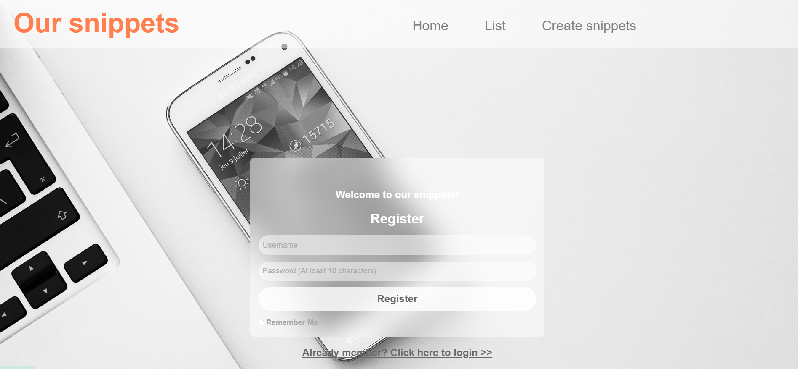
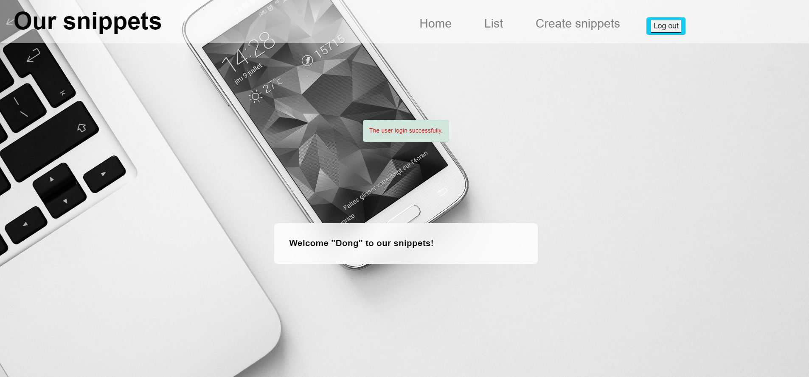
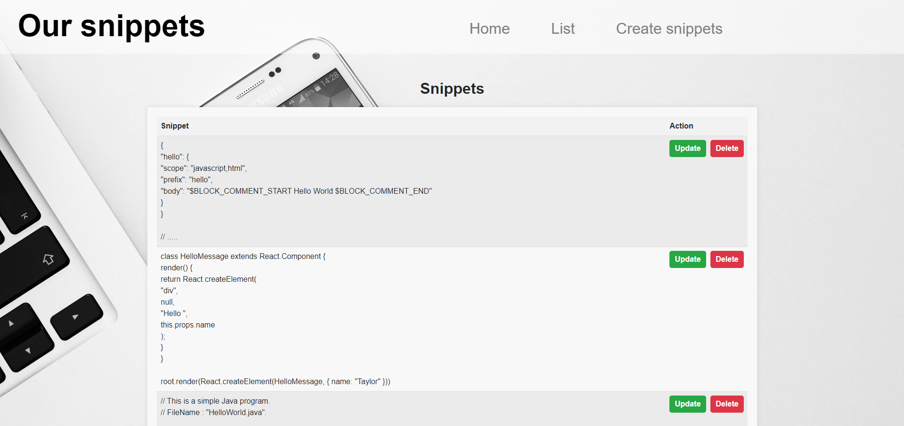

## Introduction to the CRUD Application

This web application is built using Node.js with Express as the framework and Mongoose as the Object Data Modeling (ODM) library, providing a robust platform for data persistence. The source code is organized into several modular components to ensure maintainability and scalability.

### Features and Functionality

1. **User Authentication and Authorization**
   - Users can register and log in to the application by providing a unique username and a password.
   - Passwords are securely hashed using the `bcrypt` library to prevent unauthorized recovery.
   - Once logged in, users can also log out of the application.
   - The application distinguishes between anonymous and authenticated users through basic authentication and authorization mechanisms. Session management is handled on the server side using the [express-session](https://www.npmjs.com/package/express-session) package.

2. **CRUD Operations**
   - The application supports full CRUD (Create, Read, Update, Delete) functionality for code snippets.
   - Anonymous users can view snippets, while authenticated users can create, edit, and delete their own snippets.
   - Only the owner or creator of a snippet can edit or delete it.
   - The application supports multiline text, allowing users to handle real code snippets rather than just single-line text entries.

3. **User Notifications and Error Handling**
   - To enhance usability, the application uses flash messages to keep users informed about their actions and the current state of the application.
   - HTTP status codes are used to communicate various states:
     - **404 (Not Found):** When a user requests a non-existent resource or a resource requiring authentication.
     - **403 (Forbidden):** When an authenticated user lacks permission to access a requested resource.
     - **500 (Internal Server Error):** Used sparingly, only for server-side errors.

4. **Security Measures**
   - To protect against common web vulnerabilities, the application utilizes `helmet()` to enhance security by setting various HTTP headers.

The application is designed to be intuitive and user-friendly, ensuring a seamless experience for managing and interacting with code snippets.

***
### The home page of the application:
 

***

### Page after successful login:

***

### Display all created snippets page:

***

### Demo application URL: **https://crud.dongzhutan.com/**
